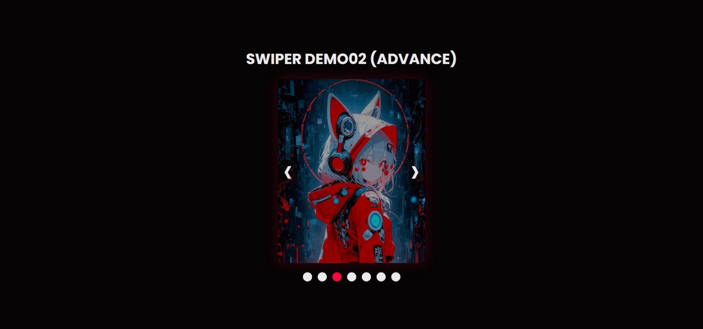

# 🎴 Swiper Demo02 (Advance)

A **custom-built image slider** built purely with **HTML, CSS, and Vanilla JavaScript** — no external libraries used.
This demo showcases a **looped swiper animation** with **smooth transitions**, **hover states**, and **indicator control buttons** — all handcrafted for learning and refinement of front-end logic.

🔗 <span><b>Live Demo:</b></span> [**View on GitHub Pages**](https://nsnet21.github.io/18-swipper-effect-2/)

---

## 🖼️ Preview



---

## 🚀 Features

- ♻️ **Infinite Loop Transition** — seamless looping using cloned slides (`firstClone`, `lastClone`).
- 🎯 **Indicator Buttons** — clickable navigation synced with current slide.
- 🧭 **Manual Controls** — next/prev buttons with transition lock to prevent double trigger.
- 💫 **Hover Effects** — dynamic blur removal and glow highlight on button hover.
- ⚙️ **Pure JavaScript Logic** — no Swiper.js or external framework.
- 🌈 **Custom Styling** — accent color theme with red glow & cyber aesthetic.
- 📱 **Responsive Ready** — slide width and animation optimized for multiple viewports.

---

## 🧩 Built With

| Stack                    | Usage                                                  |
| :----------------------- | :----------------------------------------------------- |
| **HTML5**                | Base structure of the slider and indicator buttons     |
| **CSS3**                 | Styling, transitions, hover effects, layout, and theme |
| **JavaScript (Vanilla)** | Logic for slide control, cloning, and event handling   |

---

## ⚙️ How It Works

1. The slider initializes with **7 slides**.
2. JavaScript **clones** the first and last slides to simulate an infinite loop.
3. Event listeners handle:
   - Button clicks (`next`, `back`)
   - Hover events (`mouseenter`, `mouseleave`)
   - Circle indicators (`indexContainer`)
4. The slider transitions using `translateX` to shift slides smoothly.
5. Logic ensures **no double transition** using `isTransitioning` lock.
6. Indicator buttons update dynamically based on the current slide index.

---

## 🧠 JavaScript Logic Breakdown

Below is a detailed explanation of how the code manages the swiper logic step-by-step:

### 1. DOM Declaration

```js
let slides = document.getElementsByClassName("slide");
const nextBtn = document.getElementById("next");
const backBtn = document.getElementById("back");
const indexIndicator = document.getElementsByClassName("index");
let isTransitioning = false;
```

👉 These variables grab all the key DOM elements — slides, navigation buttons, and indicators —
and define `isTransitioning` as a lock flag to prevent multiple transitions at once.

### 2. Clone Slides (Infinite Loop Illusion)

```js
const firstClone = slides[0].cloneNode(true);
const lastClone = slides[slideCount - 1].cloneNode(true);
slider.insertBefore(lastClone, slides[0]);
slider.appendChild(firstClone);
```

Creates cloned slides at both ends to simulate an **infinite loop**. </br>
When the slider reaches a clone, the code instantly “jumps” back to the real slide (handled in the `transitionend` event).

### 3. Transition Lock (Prevent Double Trigger)

```js
if (isTransitioning) return;
isTransitioning = true;
```

Ensures users can’t spam the navigation buttons during a transition. </br>
Once the animation finishes, `isTransitioning` resets to `false`.

### 4. Slide Translation

```js
slider.style.transform = `translateX(-${index * slideWidth}px)`;
```

Moves the entire `.slider` container horizontally using CSS `translateX`. </br>
Each click updates the transform based on the current `index`.

### 5. Transition End Handling

```js
slider.addEventListener("transitionend", () => {
  const currentSlide = slides[index];
  if (currentSlide.id === "first-clone") {
    slider.style.transition = "none";
    index = 1;
    updateSlide();
  }
  if (currentSlide.id === "last-clone") {
    slider.style.transition = "none";
    index = slideCount - 2;
    updateSlide();
  }
  isTransitioning = false;
});
```

Detects when a transition finishes. </br>
If the current slide is a **clone**, the slider “snaps” back to the corresponding real slide without visible flicker.

### 6. Indicator Sync Logic

```js
function updateActiveIndicator() {
  let dotIndex = index - 1;
  if (dotIndex < 0) dotIndex = indexIndicator.length - 1;
  else if (dotIndex > indexIndicator.length - 1) dotIndex = 0;
  ...
}
```

Keeps the circular indicator dots in sync with the actual slide. </br>
It compensates for the extra cloned slides by offsetting the index.

### 7. Hover State Effects

```js
function addHoverState() {
  for (let slide of slides) slide.classList.add("btn-hover-state");
}
function removeHoverState() {
  for (let slide of slides) slide.classList.remove("btn-hover-state");
}
```

Adds or removes a blur-removal class `(.btn-hover-state)` </br>
whenever the user hovers over navigation buttons or indicators — giving a subtle interactive “glow” feel.

---

## 🔁 Summary Logic Flow

1. Clone the first & last slides to fake an infinite loop
2. Initialize at `index = 1` (the real first slide)
3. On `Next` or `Back`, update index → call `updateSlide()`
4. On `transitionend`, detect if at a clone → jump to real slide
5. `updateActiveIndicator()` syncs the dots
6. Hover states trigger visual feedback (blur removal & glow)

---

## 🎨 Color & Theme

| Variable               | Description                      | Example              |
| :--------------------- | :------------------------------- | :------------------- |
| `--background`         | Main background color            | `#070405`            |
| `--accent`             | Highlight accent color           | `#fc083e`            |
| `--text`               | Foreground text color            | `#ebe9ea`            |
| `--background-overlay` | Film overlay for darkened effect | `rgba(7, 4, 5, 0.5)` |

---

## 🧠 Learning Focus

- DOM manipulation (`getElementsByClassName`, `querySelector`, etc.)
- Transition event handling (`transitionend`)
- Class toggling for dynamic state changes
- Logic separation between UI state and transition control
- Clean hover / blur animation design

---

## 📂 Folder Structure

```

18swiper-Effect2/
│
├── assets-preview/
│ └── preview.jpeg
├── images/
│ ├── img1girl02.jpg
│ ├── img2girl.jpg
│ ├── img3girl.jpg
│ ├── img4girl.jpg
│ ├── img5boy.jpg
│ ├── img6boy.jpg
│ └── img7boy.jpg
├── index.html
├── style.css
├── script.js
└── README.md

```

---

## 💡 Author Notes

> 🔥 This project was created to **deepen understanding of carousel/swiper logic** without relying on frameworks.
> It’s a fully manual implementation — ideal for strengthening event flow, state logic, and transition mechanics in front-end development.

---

## 🧠 Next Plan (Possible Upgrades)

- Add **autoplay** function with pause-on-hover
- Implement **touch/swipe gesture** for mobile devices
- Add **caption or title overlay** per slide
- Create **dynamic slide injection** via JSON

---

## 📜 License

This project is for **learning and personal portfolio purposes**.
Feel free to fork or remix with credit. 🦊

---

**Created by [Nate](https://github.com/nsnet21)** — a front-end developer passionate about **interactive UI, animation logic, and Japanese-inspired design**.
This project was built as part of a continuous learning journey in **HTML, CSS, and Vanilla JavaScript**, exploring custom slider logic beyond libraries.

> 💡 Focus: mastering motion, event flow, and loop logic to simulate seamless Swiper behavior without external frameworks.

---
